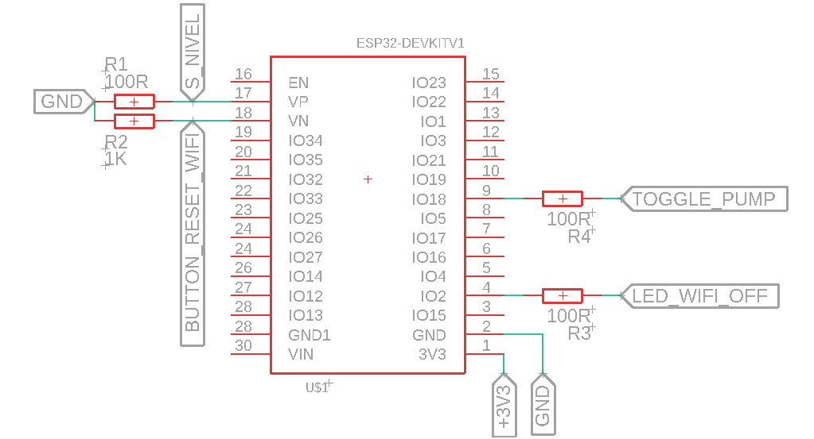
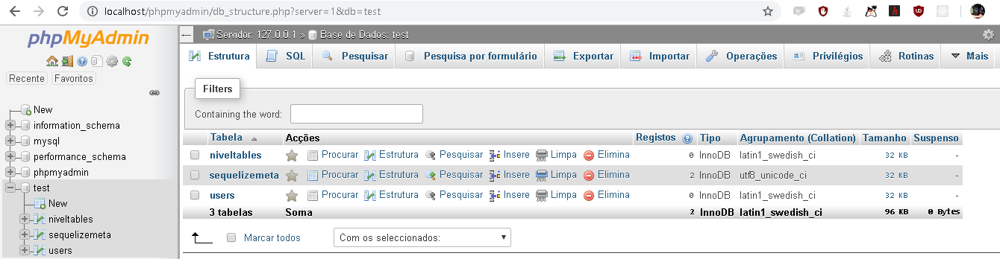

# Water Resource
<a href="https://github.com/rafaelbodao/waterresource/tree/master/article" alt="IFMG">
</a>
<a href="https://www.hedro.com.br/" alt="Hedro">
</a>

<br />
<br />

<p align="justify">
Water Resource é um projeto open source que tem como intuito apresentar para a comunidade de desenvolvimento um sistema de automação residencial utilizando o conceito de internet das coisas, integrando tecnologias modernas como: NodeJs, WebSocket, ReactJs, ESP32 dentre outras. O objetivo da aplicação é apresentar uma forma de monitorar e controlar o nível de um reservatório de água, juntamente com uma interface ao usuário, onde o usuário poderá acompanhar em tempo real o estado do sistema e interagir com o sensor configurando alguns parâmetros de aquisição. O sistema foi projetado para fornecer ao usuário confiabilidade e facilidade de controle. Leia mais sobre a aplicação em:
</p>

> https://waterresource.hopto.org

## Get Started

<p align="justify">
A seguir tem-se os passos para poder replicar os recursos do projeto, os itens Servidor-Local e Servidor-Remoto precisam ser hospedados em um ambiente virtual que tenha suporte para o mesmo, no minimo 1GB de memória RAM e 25GB de armazenamento. Cada tópico apresenta as medidas necessárias para poder colocar a aplicação em funcionamento tanto em um servidor local quanto em um servidor remoto.
</p>

- [Firmware](#Firmware)
  - [Premissas](##Premissas)
  - [Bibliotecas](##Bibliotecas)
  - [Upload-do-Firmware](##Embarcar-Firmware)
- [Servidor-Local](#Servidor-Local)
  - [Premissas](##Premissas)
  - [Back-End](##Back-End)
  - [Front-End](##Front-End)
- [Servidor-Remoto](#Servidor-Remoto)
  - [Premissas](##Premissas)
  - [Back-End](##Back-End)
  - [Front-End](##Front-End)
- [Hardware](#Hardware)
- [Referências](#Referências)
- [Licença](#Licença)

## Firmware

### Premissas

Inicialmente deve-se instalar o compilador utilizado:

- <a href="https://www.arduino.cc/en/Main/Software" target="_blank">Arduino IDE</a>

<p align="justify">
Com a IDE do Arduino devidamente instalada, instale as dependências da placa do ESP32 para que seja possível embarcar o firmewere no devKit ESP32, seguindo este <a href="https://www.fernandok.com/2018/09/instalando-esp32-no-arduino-ide-metodo.html" target="_blank">tutorial</a>.
</p>

<p align="justify">
Atente-se para o fato, que o projeto foi baseado na arquitetura do ESP32, sendo assim o funcionamento do mesmo só é garantido utilizando-o.
</p>

Após realizar devidamente as instalações clone o repositório:

> git clone https://github.com/rafaelbodao/waterresource.git

### Bibliotecas

<p align="justify">
Com a IDE devidamente configurada agora faz-se necessário instalar as bibliotecas que foram utilizadas no projeto. Por meio do gerenciador de bibliotecas da IDE, faça o download da biblioteca WiFi na versão 1.27 e ArduinoJson na versão 6.9.1. Ainda na instalação das bibliotecas porém agora instalando por meio de arquivos .zip, faça o download do seguintes repositórios com o formato .zip e insira-os na IDE <a href="https://github.com/zhouhan0126/WIFIMANAGER-ESP32" target="_blank">repositório 1</a>, <a href="https://github.com/zhouhan0126/DNSServer---esp32" target="_blank">repositório 2</a> e <a href="https://github.com/zhouhan0126/WebServer-esp32" target="_blank">repositório 3</a>
</p>

<p align="justify">
A biblioteca Web Service instalada por meio do repositório 3, possui um erro em sua arquitetura que faz gerar um conflito na renderização de um elemento HTML, assim faz-se necessário alterar o nome deste elemento no arquivo HTTP_Method.h. Para acessar este arquivo, só é possível por meio  do terminal. Com o Git Bash aberto deve-se acessar o diretório da biblioteca por meio do comando:
</p>

> cd c:\Users\YOUR_USER\AppData\Local\Arduino15\packages\esp32\hardware\esp32\1.0.0\libraries\WebService

<p align="justify">
Atente-se onde está escrito YOUR_USER deve-se inserir o usuário do computador onde foi instalado todas as dependências anteriormente. Ao acessar o devido diretório execute:
</p>

> sudo nano HTTP_Method.h

<p align="justify">
Acessando assim o conteúdo do arquivo. Encontre:
</p>

> HTTP_HEAD = 0b00100000

<p align="justify">
e substitua por:
</p>

> HTTP_HEADER = 0b00100000.

<p align="justify">
Após utilize o comando para fechar e salvar as alterações:
</p>

> Control + X

### Upload-do-Firmware
<p align="justify">
Com o repositório devidamente clonado, acesse o diretório firmware/WaterResource, abra e compile o arquivo WaterResource.ino. Após a compilação, faça o upload do firmware. A figura abaixo apresenta o esquemático a ser seguido para instalar os periféricos.
</p>



<p align="justify">
O protótipo desenvolvido com base no DevKit ESP32 e alguns outros periféricos tem como intuito ser uma plataforma de testes e não um produto para possível produção. O desenvolvimento de um hardware para a produção deve ser baseado no microcontrolador <a href="https://www.espressif.com/sites/default/files/documentation/esp32_datasheet_en.pdf" target="_blank">MCU ESP32</a> e não no DevKit ESP32, assim alem de reduzir consideravelmente o custo de cada sensor, o desepenho e a durabilidade do micocontrolador sera bem maior pois o mesmo tera apenas as funcionalidades necessarias para aplicação.
</p>


## Servidor-Local

### Premissas

Inicialmente instale os seguintes itens abaixo:

- <a href="https://nodejs.org/en/" target="_blank">NodeJs</a>
- <a href="https://gitforwindows.org/" target="_blank">Git Bash</a>
- <a href="https://www.apachefriends.org/pt_br/index.html" target="_blank">XAMPP</a>

Instale o gerenciador de processos <a href="http://pm2.keymetrics.io/" target="_blank">PM2</a>:

> sudo npm install pm2 -g

*Se estiver utilizando o Windows faz-se necessário executar o terminal como administrador

### Back-End

<p align="justify">
Com o repositório Water Resource clonado, e todos os passos anteriores realizados, acesse o diretório do repositório por meio do terminal, dentro da pasta backEnd execute o seguinte comando:
</p>

> npm install

<p align="justify">
Ao executá-lo será instalado todas as dependências necessárias. Na pasta backEnd, existe um arquivo denominado .env.exemple, porém este arquivo só pode ser visualizado por meio do terminal ou por algum editor de texto como por exemplo VSCode, ainda na pasta backEnd execute os comandos abaixo sequencialmente:
</p>

> cp .env.exemple .env

> sudo nano .env

<p align="justify">
Abrindo o conteúdo do arquivo, este arquivo contém as variáveis de ambiente que configuram toda a aplicação de back-end, caso você tenha seguido os passos anterior devidamente, simplesmente delete todo o conteúdo e copie o conteúdo logo abaixo e cole dentro do arquivo, caso tenha realizado os procedimentos anteriores de outra forma, entre com as devidas informações conforme é solicitado.
</p>

```javascript
module.exports = {
username: "root",
password: "",
database: "test",
host: "127.0.0.1",
dialect: "mysql",
saltRounds: 10,
tokenKey: "WR_2019_LOCAL_SERVER",
gmail:'YOUR_EMAIL_TO_SEND@gamil.com',
emailPassword: 'YOUR_EMAIL_PASSWORD',
}
```

<p align="justify">
Note que os campos gmail e emailPassword, deve ser inserido um e-mail e senha do gmail utilizado para enviar o email de confirmação de cadastro. Para que a aplicação de confirmação de cadastro por e-mail possa funcionar corretamente é necessário habilitar o acesso de aplicações de terceiros no gmail, faça o logIn no e-mail que deseja configurar e acesse este <a href="https://myaccount.google.com/lesssecureapps?utm_source=google-account&utm_medium=web" target="_blank">link</a>, habilitando assim o acesso a terceiros. Em seguida inicie o servidor Apache e o infraestrutura de banco de dados MySQL provida pelo XAMPP.
</p>

No diretório do backEnd digite o seguinte comando:

> node_modules\.bin\sequelize db:migrate

<p align="justify">
Ao executar este comando, se realizado os passos anteriores corretamente, será criado no banco de dados local a estrutura de persistência de dados, esta estrutura pode ser verificada acessando a aplicação de gerenciamento de banco de dados phpMyAdmin, digite em seu navegador de internet:
</p>

> localhost/phpmyadmin

<p align="justify">
Dentro da interface acesse o banco de dados test. A figura abaixo apresenta como é disposta a estrutura de dados.
</p>



<p align="justify">
O último passo é executar o servidor, para isso ainda dentro do diretório backEnd execute o seguinte comando:
</p>

> pm2 start src/server.js

<p align="justify">
Neste momento o servidor que cuidará de todas requisições provenientes do gateway (ESP 32) e da interface do usuário já está devidamente funcionando. Caso deseje verificar os status do servidor, basta digitar o seguinte comando:
</p>

> pm2 list

<p align="justify">
Caso queira parar o servidor, utilize o seguinte comando:
</p>

> pm2 stop src/server.js

### Front-End

<p align="justify">
Após realizar o procedimentos do Back-End em servidor local, abra uma nova aba do terminal e acesse o diretório frontEnd, execute o seguinte comando:
</p>

> npm install

<p align="justify">
Da mesma forma que foi realizado anteriormente, faz-se necessário modificar o arquivo de variáveis ambientes para configurar a aplicação, acesse o diretório frontEnd/src, por meio do comando:
<p>

> cd frontEnd/src

<p align="justify">
Altere o nome do arquivo “environment.exemple.js” para “environment.js”, utilizando o seguinte comando:
<p>

> mv environment.exemple.js environment.js

<p align="justify">
Se todos os passos foram seguidos corretamente, a única alteração necessária no arquivo será inserir o Ip local de onde a aplicação está sendo provida, assumindo o Ip local sendo: 192.168.100.3 a arquivo de configuração ficará:
<p>

```javascript
import socket from "socket.io-client"

/*
 * Dashboard exports
 */
export const dashboadURL = "http://192.168.100.3:3000";

export const socketIO = socket("http://192.168.100.3:3333");

export const difereceTime = 2;
/*
 * SignUp exports 
 */
export const hrefURL = "http://192.168.100.3:3000";

/*
 * Services exports
 */

//API AXIOS SERVICES
export const serverBaseURL = "http://192.168.100.3:3333";

//TOKEN ID
export const TOKEN_ID = "WR_IFMG"

```

<p align="justify">
Porém se foi realizado algum procedimento diferente, altere o arquivo environment.js conforme a necessidade. Por fim execute os comando abaixo em sequência:
</p>

> npm run build

> pm2 start server.js

<p align="justify">
Assim a aplicação Web estará pronta para uso em sua rede local, a mesma pode ser acessada por outros dispositivos que estiverem conectados a sua rede, basta acessar o Ip do computador que estiver hospedando a aplicação como por exemplo: 192.168.100.3:3000
</p>

<p align="justify">
Observação 1: Para que o serviço Web seja acessado é necessário realizar todos os procedimentos de inicialização, desde inicialização do XAMPP até a inicialização do Front-End.
</p>

<p align="justify">
Observação 2: O gateway está configurado para enviar as aquisições para o servidor local considerando um userId = 1, sendo assim faz necessário alterar o endereço do servidor local nas variáveis globais dentro do firmware e o Id do usuário criado no ato do cadastro do mesmo, considerando que o endereço Ip local do servidor seja 192.198.100.3 e o Id do usuario seja 1, a configuração das variáveis pode ser feita:
</p>

> \#define urlConfiguration “http://192.168.100.3:3333/gateway/configuration”

> \#define urlComunication “http://192.168.100.3:3333/gatewat/nivel”

> \#define userId 1


<!--  -->
## Servidor-Remoto

### Premissas

<p align="justify">
Para realizar o procedimento aqui apresentado faz-se necessário ter acesso a uma máquina virtual hospedada em alguma empresa de hospedagem. Utilizou-se uma máquina virtual hospedada no servidor da <a href="https://www.apachefriends.org/pt_br/index.html" target="_blank">Digital Ocean</a>, tendo 1GB de memória RAM, 25GB de armazenamento, com o sistema operacional Ubuntu 16.04.5 x64. Os procedimentos aqui apresentados funcionam especificamente para o sistema operacional utilizado.
</p>

<p align="justify">
Além da infraestrutura de hospedagem, faz-se necessário criar um “Sistema de nome de domínio” (DNS) para poder apontar para o Ip de sua máquina virtual, existem diversos provedores de DNS gratuitos, para a execução deste utilizou-se o <a href="https://www.apachefriends.org/pt_br/index.html" target="_blank">NO-IP</a>.
</p>

<p align="justify">
Após a criação do droplet Digital Ocean, será informado um acesso remoto a máquina virtual. Este acesso é criado de forma automática, com um usuário Root e uma senha. Existem boas práticas para poder configurar a conexão ssh com a máquina virtual, porém fica a cargo do leitor as realizá-las, neste iremos utilizar o acesso da forma em que é fornecido.
</p>

<p align="justify">
Antes de realizar o procedimento de hospedagem em um servidor remoto, realize o procedimento para servidor local, pois alguns passos realizados anteriormente serão fundamentais para esta etapa.
</p>

<p align="justify">
Abra o terminal de sua máquina local utilizando o Git Bash e digite os comandos sequencialmente:
</p>

> sudo apt-get updtae

> sudo apt-get install ssh

<p align="justify">
Tendo criado devidamente o droplet, o acesso a máquina virtual será realizado via conexão ssh por meio do IPv4 fornecido, considerando que o IPv4 fornecido seja “000:000:000:000”, execute o comando abaixo:
</p>

> ssh root@000:000:000:000

<p align="justify">
Em seguida será solicitado a senha de acesso, inserido a senha fornecida, você realizará o acesso remoto a seu ambiente de produção. Inicialmente faz-se necessário realizar a instalação de três dependências persistentes no pacote LEMP e configurá-las devidamente. A sigla LEMP representa as arquiteturas de desenvolvimento L = Linux, E = Enginex (nginx), M = MySQL e P = PHP, por meio destes pacotes podemos configurar toda a infraestrutura que vai receber a aplicação web.</p>

##### MySQL Server

<p align="justify">
A tecnologia MySQL é um ambeinte de desenvolvimento complexo e robusto, na sua versão 5.7 utiliza a base dados do MariaDB, execute o comando abaixo:
</p>

> sudo apt-get install mysql-server

<p align="justify">
Após a finalização da instalação do servidor MySQL, faz-se necessário configurá-lo, para isso digite o comando abaixo:
</p>

> mysql_secure_installation

<p align="justify">
Leia atentamente tudo que é informado e confira todas as solicitações que o MySQL irá dispor na tela. Após finalizar este procedimento verifique se a configuração foi realizada com sucesso, digitando o comando:
</p>

> systemctl status mysql.service

Caso o servidor estiver Off force a reinicialização:

> sudo systemctl start mysql

<p align="justify">
No momento em que foi instalado e configurado o servidor MySQL, gerou-se um usuário padrão, denominado root, assim faz-se necessário alterar a senha deste usuário para uma senha segura, criar uma base de dados e fornecer acesso do usuário a base de dados criada para a aplicação. Digite os comandos abaixo sequencialmente, atente-se onde está escrito 'password' insira sua senha.
</p>

> mysql -u root -p

> UPDATE mysql.user SET authentication_string = PASSWORD('password') WHERE User = 'root';

> FLUSH PRIVILEGES;

> CREATE DATABASE waterresource;

> GRANT ALL PRIVILEGES ON waterresource.* to root@localhost;

>FLUSH PRIVILEGES;

Digite o comando abaixo para verificar se a base de dados foi devidamente criada:

> SHOW DATABASE;

> exit

##### PHP-FPM
<p align="justify">
Com o banco de dados devidamente instalado e configurado, digite o comando abaixo, para instalar o processador de PHP:
</p>

>sudo apt-get install php-fpm php-mysql

>sudo nano /etc/php/7.0/fpm/php.ini

<p align="justify">
Busque pelo conteúdo:
</p>

> ;cgi.fix_pathinfo=1

e altere para:

> cgi.fix_pathinfo=0

Reinicie o processador PHP

>sudo systemctl restart php7.0-fpm


##### Nginx

<p align="justify">
Próximo passo é instalar o Nginx que fornecerá um servidor de conteúdo estático (utilizado na aplicação de gerenciamento do banco de dados phpMyAdmin) e gerenciamento do proxy reverso do servidor, execute o comando abaixo:
</p>

>sudo apt-get install nginx

>sudo ufw allow 'Nginx HTTP'

<p align="justify">
Habilite o FireWall para aceitar solicitações do tipo HTTP e HTTPS, executando os comandos abaixo em sequência.
</p>

>sudo ufw allow OpenSSH

>sudo ufw allow http

>sudo ufw allow https

>sudo ufw enable

<p align="justify">
Neste momento se todos os procedimentos foram realizados corretamente, é possível acessar o IPv4 da máquina virtual, sendo renderizado a página de boas vindas do Nginx.
</p>

##### NodeJs

<p align="justify">
Instale o NodeJs por meio do repositório do Node, execute os comandos abaixo de forma sequencial.
</p>

>sudo apt-get install curl

>curl -sL https://deb.nodesource.com/setup_10.x | sudo bash -

>sudo apt install nodejs

Instale o gerenciador de processos <a href="http://pm2.keymetrics.io/" target="_blank">PM2</a>:

>sudo npm install pm2 -g

##### Let's Encrypt

<p align="justify">
O próximo passo é configurar o certificado SSL de criptografia, existem diversas formas de obter esta certificação, uma delas é utilizando o Let’s Encrypt que é uma aplicação criada e sustentada pela Linux Foundation, permitindo estabelecer conexões seguras de forma simples e gratuita. Execute os comandos abaixo de forma sequencial.
</p>

>sudo apt-get install bc

>sudo git clone https://github.com/letsencrypt/letsencrypt /opt/letsencrypt

<p align="justify">
Para criar a certificação é necessário ter criado um DNS previamente, assumindo que o DNS criado chama-se meusite.com.br. Execute os comandos de forma sequencial.
</p>

>dig +short meusite.com.br

Retornando o IPv4 para onde o DNS aponta.

>cd /opt/letsencrypt

>./certbot-auto certonly --standalone

>/opt/letsencrypt/certbot-auto renew

<p align="justify">
Ao realizar esta etapa, o certificado estará devidamente configurado e renovará sua chave de segurança de forma automática mensalmente.
</p>

<p align="justify">
Para garatir a segurança criptografia configurada, faz necessario utilizar uma tecnologia de trocas de chave, optou-se por utilizar o DIFFIE-HELLMAN GROUP. Assim para configurar corretamente a certificação, execute os comandos abaixo:
</p>

> sudo openssl dhparam -out /etc/ssl/certs/dhparam.pem 2048

O comando acima executa um procedimento que pode levar alguns minutos.

> sudo nano /etc/nginx/snippets/ssl-params.conf

Dentro do arquivo de configuração criado, insira:
```
ssl_protocols TLSv1 TLSv1.1 TLSv1.2;
ssl_prefer_server_ciphers on;
ssl_ciphers "EECDH+AESGCM:EDH+AESGCM:AES256+EECDH:AES256+EDH";
ssl_ecdh_curve secp384r1; # Requires nginx >= 1.1.0
ssl_session_cache shared:SSL:10m;
ssl_session_tickets off; # Requires nginx >= 1.5.9
ssl_stapling on; # Requires nginx >= 1.3.7
ssl_stapling_verify on; # Requires nginx => 1.3.7
resolver 8.8.8.8 8.8.4.4 valid=300s;
resolver_timeout 5s;
add_header Strict-Transport-Security "max-age=63072000; includeSubDomains; preload";
add_header X-Frame-Options DENY;
add_header X-Content-Type-Options nosniff;

# Add our strong Diffie-Hellman group
ssl_dhparam /etc/ssl/certs/dhparam.pem;
```
Execute o comando para sair do arquivo e salvar as alterações:

> Control + X

##### Proxy Reverso

<p align="justify">
Por definição do protocolo HTTP ao acessarmos um servidor por meio de seu IPv4, a requisição é direcionada diretamente para a aplicação da porta 80, sendo assim ao acessar o domínio que aponta para o IPv4 diretamente o acesso é direcionado para a porta 80, para direcionar o acesso do DNS para as devidas aplicações faz-se necessário redirecionar todas as requisições que chegam direto ao IPv4 da aplicação para as aplicações na porta 3000 (onde é provido o front-end) e 3333 (onde é provido a back-end). Execute o comando abaixo</p>

> sudo nano /etc/nginx/sites-enabled/default

Dentro do arquivo, apague todo o conteúdo e copie o conteúdo apresentado abaixo. Atente-se onde está escrito 'meusite.com.br', insira o seu DNS.
```
# HTTPS  proxy all requests to the Node app
server {
# Enable HTTP/2
listen 443 ssl http2;
listen [::]:443 ssl http2;

server_name meusite.com.br;

root /var/www/html;
index index.php index.html index.htm index.nginx-debian.html;

# Use the Lets Encrypt certificates
ssl_certificate /etc/letsencrypt/live/meusite.com.br/fullchain.pem;
ssl_certificate_key /etc/letsencrypt/live/meusite.com.br/privkey.pem;

# Include the SSL configuration from cipherli.st
include snippets/ssl-params.conf;

   location /phpmyadmin {
          root /usr/share/;
          index index.php index.html index.htm;
          location ~ ^/phpmyadmin/(.+\.php)$ {
                  try_files $uri =404;
                  root /usr/share/;
                  fastcgi_pass 127.0.0.1:9000;
                  fastcgi_index index.php;
                  fastcgi_param SCRIPT_FILENAME $document_root$fastcgi_script_name;
                  include /etc/nginx/fastcgi_params;
          }
          location ~* ^/phpmyadmin/(.+\.(jpg|jpeg|gif|css|png|js|ico|html|xml|txt))$ {
                  root /usr/share/;
          }
   }
   location /phpMyAdmin {
          rewrite ^/* /phpmyadmin last;
   }
    location ~ \.php$ {
       include snippets/fastcgi-php.conf;
       fastcgi_pass unix:/run/php/php7.0-fpm.sock;
   }

   location ~ /\.ht {
       deny all;
   }
    location / {
       proxy_set_header X-Real-IP $remote_addr;
       proxy_set_header X-Forwarded-For $proxy_add_x_forwarded_for;
       proxy_set_header X-NginX-Proxy true;
       proxy_pass http://localhost:3000/;
       proxy_ssl_session_reuse off;
       proxy_set_header Host $http_host;
       proxy_cache_bypass $http_upgrade;
       proxy_redirect off;
   }
    location /backend {
       proxy_set_header X-Real-IP $remote_addr;
       proxy_set_header X-Forwarded-For $proxy_add_x_forwarded_for;
       proxy_set_header X-NginX-Proxy true;
       proxy_pass http://localhost:3333/socket.io/;
       proxy_ssl_session_reuse off;
       proxy_set_header Host $http_host;
       proxy_cache_bypass $http_upgrade;
       proxy_redirect off;
   }

   location /backend/users {
       proxy_set_header X-Real-IP $remote_addr;
       proxy_set_header X-Forwarded-For $proxy_add_x_forwarded_for;
       proxy_set_header X-NginX-Proxy true;
       proxy_pass http://localhost:3333/users/;
       proxy_ssl_session_reuse off;
       proxy_set_header Host $http_host;
       proxy_cache_bypass $http_upgrade;
       proxy_redirect off;
   }
   location /backend/gateway {
       proxy_set_header X-Real-IP $remote_addr;
       proxy_set_header X-Forwarded-For $proxy_add_x_forwarded_for;
       proxy_set_header X-NginX-Proxy true;
       proxy_pass http://localhost:3333/gateway/;
       proxy_ssl_session_reuse off;
       proxy_set_header Host $http_host;
       proxy_cache_bypass $http_upgrade;
       proxy_redirect off;
   }
}

```
Em seguida reinicie o restart o Nginx:

> sudo systemctl start nginx

> sudo systemctl restart nginx

Verifique se o procedimento foi realizado corretamente por meio do comando:

>s udo nginx -t

<p align="justify">
Assim o Nginx retorna o status da configuração, caso retorne algum possível erro, refaça todo o procedimento de configuração do Nginx.
</p>

##### phpMyAdmin
<p align="justify">
Phpmyadmin é uma aplicação de fácil utilização para gerenciamento de banco de dados relacionais, execute o comando abaixo:
</p>

> sudo apt-get install phpmyadmin

<p align="justify">
Durante a instalação será requisitado algumas configurações. Primeiramente solicita-se a configuração do servidor que suportará a aplicação, o gerenciador de instalação irá apresentar duas tecnologias apache2 e lighttpd, como não será utilizado nenhuma das duas, apenas pressione TAB e em seguida ENTER. O gerenciador de instalação questionará se deseja configurar a aplicação do phpmyadmin por meio do dbconfig-commun, selecione NAO para dar prosseguimento a instalação. O acesso a aplicação de gerenciamento de banco de dados necessita de uma configuração de segurança, para que somente usuários credenciados possa acessar a rota da aplicação, execute o comando abaixo:
</p>

> sudo apt install apache2-utils

<p align="justify">
Em seguida configure um usuário e senha, ao executar o comando abaixo cria-se um usuário com o nome ‘myuser’ e uma senha relacionada a este usuário.
</p>

> sudo htpasswd -c /etc/nginx/.htpasswd myuser

Reinicie o Nginx:
> sudo systemctl start nginx

> sudo systemctl restart nginx

<p align="justify">
Assim so é possivel acessar a rota ‘meusite.com.br/phpmyadmin’ inserindo as credenciais criadas anteriormente.
</p>

<p align="justify">
Tendo realizado devidamente todo o procedimento apresentado, pode-se iniciar o processo de deploy da aplicação. Inicialmente deve-se criar um repositório PRIVADO com seu acesso ao Github, pois o ambiente de produção dificulta realizar algumas alterações no aplicação, sendo assim antes de enviar a aplicação para a máquina virtual, iremos alterá-la para que não haja necessidade fazer essas alterações via terminal. 
</p>
<p align="justify">
Tendo criado o repositório PRIVADO para deploy, clone este repositório em um diretório em seu computador. Após clonar copie e cole neste diretório as pastas frontEnd e backEnd, assim a partir de agora sempre que referenciar backEnd ou frontEnd estará sendo referindo ao repositório de deploy
</p>

<p align="justify">
No diretório do backEnd, deve-se alterar o arquivo de variáveis ambientais para as configurações realizadas na máquina virtual, como mostrado o exemplo abaixo:
</p>

```
module.exports = {
  username: "root",
  password: "YOUR_ROOT_PASSWORD",
  database: "waterresource",
  host: "127.0.0.1",
  dialect: "mysql",

  saltRounds: 10,
  
  tokenKey: "WTR_2019",

  gmail:'YOUR_EMAIL@gmail.com',
  emailPassword: YOUR_EMAIL_PASSWORD,

  emailURL: "https://MEUSITE.COM.BR/emailconfirme?rock={1}"
}

```
<p align="justify">
Salve as alterações e em seguida exclua o arquivo .gitignore que esta no diretorio do backEnd, executando o comando abaixo:
</p>

> sudo rm -rf .gitignore

<p align="justify">
Acesse o diretório do frontEnd, exclua o arquivo .gitignore, semelhante ao que foi feito anteriormente, abra o arquivo src/environment.js, apague todo o conteúdo e copie o conteúdo apresentado abaixo:
</p>

```
import socket from "socket.io-client"

/*
* Dashboard exports
*/
export const dashboadURL = "https://MEUSITE.COM.BR";

export const socketIO = socket.connect('https://MEUSITE.COM.BR', {path: '/backend'});

export const difereceTime = 2;
/*
* SignUp exports
*/
export const hrefURL = "https://MEUSITE.COM.BR";

/*
* Services exports
*/

//API AXIOS SERVICES
export const serverBaseURL = "https://MEUSITE.COM.BR/backend";

//TOKEN ID
export const TOKEN_ID = "WTR_2019"
```
<p align="justify">
Atente-se para onde está indicado ‘MEUSITE.COM.BR’, deve ser inserido o DNS configurado anteriormente. Salve o arquivo e execute o comando abaixo:
</p>

> npm run build

<p align="justify">
Em seguida faça o commit e o push para o seu repositório de deploy.
</p>

### Back-End
<p align="justify">
Com o acesso a máquina virtual, execute os comandos abaixo em sequência:
</p>

> cd

> mdkdir WaterResourcer

> cd WaterResourcer

<p align="justify">
Clone o repositório, executando o comando abaixo: 
</p>

>git clone https://github.com/YOURGITHUB/deploy.git

<p align="justify">
Sendo um repositório privado, será preciso inserir suas credenciais do Github para realizar o procedimento de clonagem. Em seguida acesse o diretório do backEnd, executando o comando abaixo:
</p>

> cd 

> cd WaterResourcer/deploy/backEnd

<p align="justify">
Instale as dependências da aplicação, utilizando o comando abaixo:
</p>

> npm install

<p align="justify">
Crie a arquitetura de persistência de dados da aplicação, execute o comando abaixo:
</p>

> node_modules/.bin/sequelize db:migrate

<p align="justify">
Acessando a aplicação de gerenciamento do banco de dados phpMyAdmin é possível constatar se foi criado de fato a arquitetura de persistência de dados.
</p>

<p align="justify">
Inicialize o Back-End utilizando o comando abaixo:
</p>

>pm2 start src/server.js

### Front-End
<p align="justify">
Acesse o diretório do frontEnd, executando os comandos abaixo:
</p>

> cd

> cd WaterResourcer/deploy/frontEnd

<p align="justify">
Instale as dependências executando o comando:
</p>

>npm install

<p align="justify">
Por fim coloque a aplicação de Front-End no ar executando o comando abaixo:
</p>

>pm2 start server.js

<p align="justify">
Qualquer duvidas entre em contato por meio do email: rafael.rac.mg@gmail.com
</p>

## Referências

##### Firmware

<a href="https://www.espressif.com/en/products/hardware/esp32/overview" target="_blank">ESP 32</a><br />
<a href="https://github.com/tzapu/WiFiManager" target="_blank">Wifi Manager</a><br />
<a href="https://www.arduino.cc/reference/en/" target="_blank">Arduino IDE</a><br />

##### Infraestrutura

<a href="https://www.digitalocean.com/" target="_blank">Digital Ocean</a><br />
<a href="https://www.nginx.com/" target="_blank">Nginx</a><br />
<a href="https://www.mysql.com/" target="_blank">MySQL</a><br />
<a href="https://letsencrypt.org/" target="_blank">Let's Encrypt</a><br />
<a href="https://www.phpmyadmin.net/" target="_blank">phpMyAdmin</a><br />
<a href="https://code.lengstorf.com/deploy-nodejs-ssl-digitalocean/" target="_blank">Deploying Aplications in Digital Ocean - Jason Lengstrof</a><br />

##### Back-End

<a href="https://nodejs.org/en/" target="_blank">NodeJs</a><br />
<a href="https://expressjs.com/pt-br/" target="_blank">ExpressJs</a><br />
<a href="https://github.com/expressjs/cors" target="_blank">Cors</a><br />
<a href="https://socket.io/" target="_blank">Socket.io</a><br />
<a href="https://www.npmjs.com/package/bcryptjs" target="_blank">bcryptJs</a><br />
<a href="https://jwt.io/" target="_blank">JWT</a><br />
<a href="http://docs.sequelizejs.com/" target="_blank">Sequelize</a><br />
<a href="https://nodemailer.com/about/" target="_blank">Nodemailer</a><br />

##### Front-End

<a href="https://reactjs.org/" target="_blank">ReactJs</a><br />
<a href="https://reactstrap.github.io/" target="_blank">React Bootstrap</a><br />
<a href="https://fontawesome.com/" target="_blank">React Font Awesome</a><br />
<a href="https://pushjs.org/" target="_blank">Push Notification</a><br />
<a href="https://socket.io/docs/client-api/" target="_blank">Socket.io-client</a><br />
<a href="https://github.com/axios/axios" target="_blank">Axios</a><br />


## Licença

[](https://github.com/rafaelbodao/waterresource/blob/master/LICENSE)


